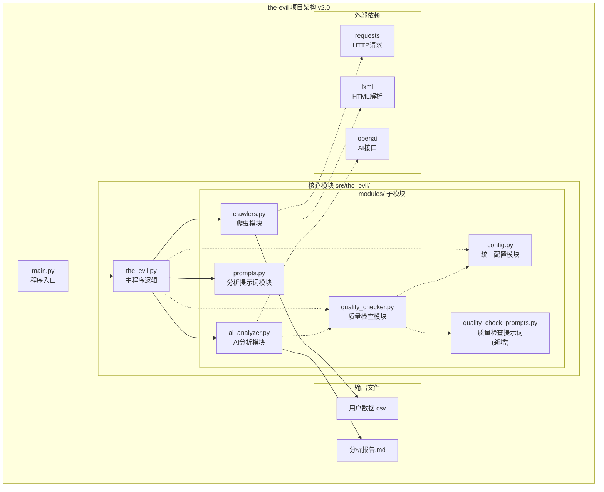
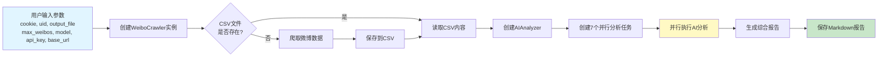
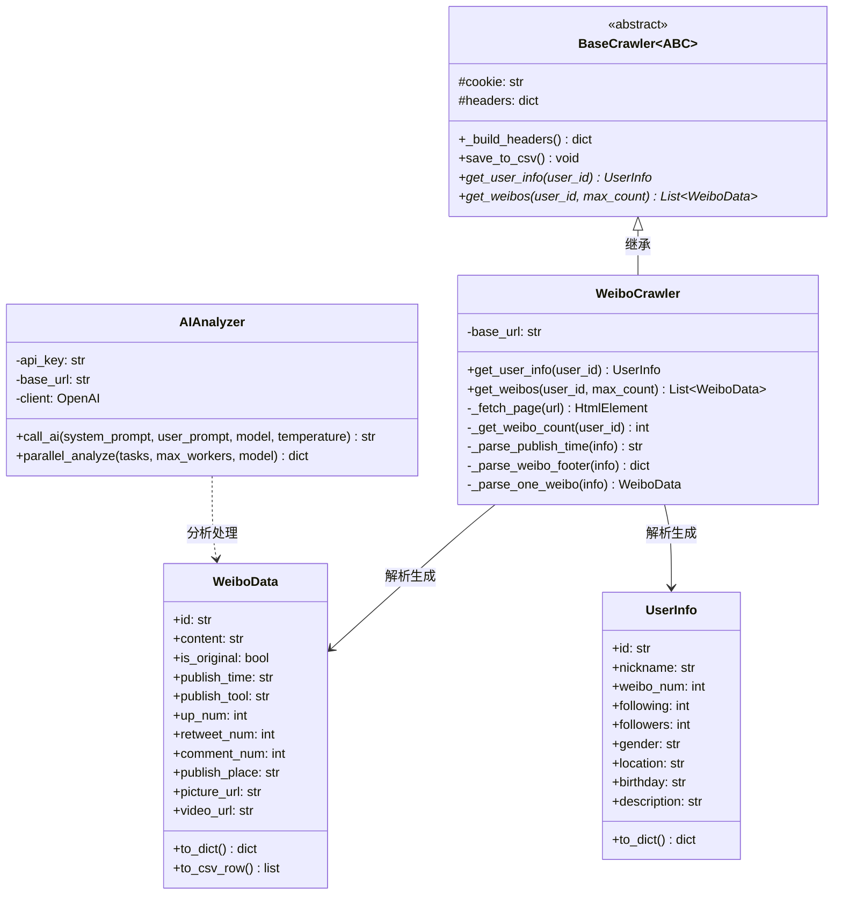
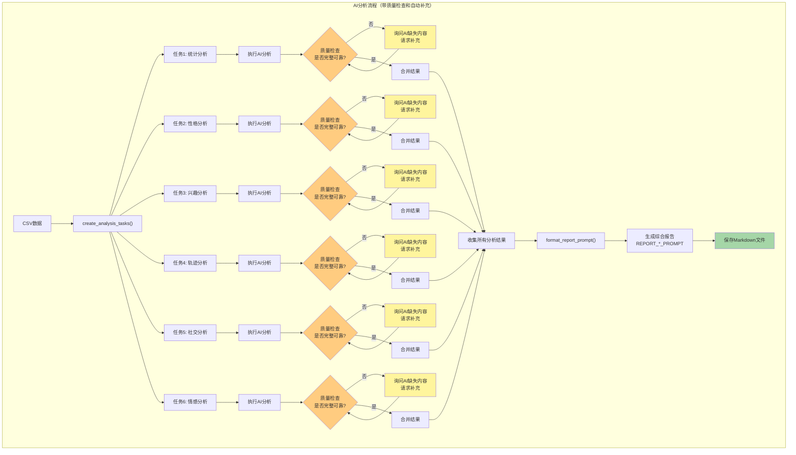
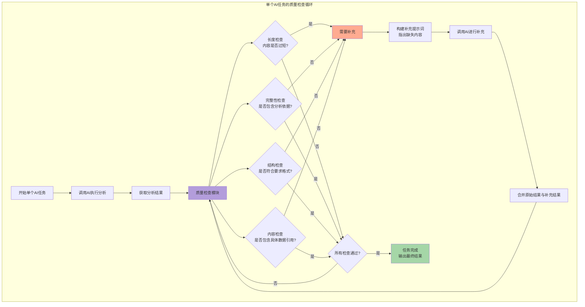
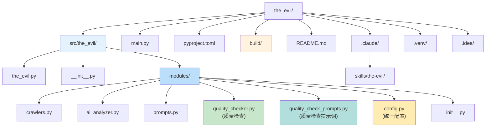
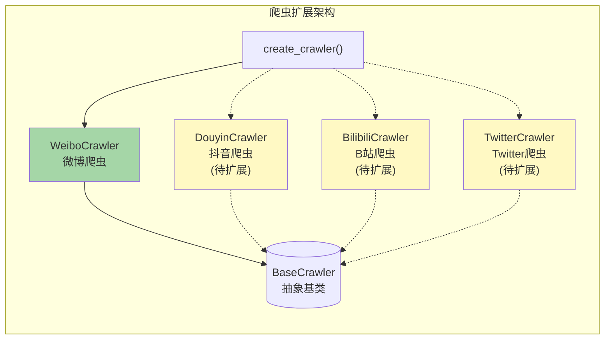

# the-evil 项目结构图

本文档包含 the-evil 项目的完整架构结构图。

## 目录

1. [项目整体架构图](#项目整体架构图)
2. [数据流图](#数据流图)
3. [类结构图](#类结构图)
4. [AI分析任务流程图](#ai分析任务流程图)
   - [并行分析流程图](#并行分析流程图)
   - [单个任务质量检查详细流程](#单个任务质量检查详细流程)
5. [文件目录结构图](#文件目录结构图)
6. [扩展设计图](#扩展设计图)
7. [模块导入机制说明](#模块导入机制说明)
8. [质量检查模块说明](#质量检查模块说明)

---

## 项目整体架构图



**说明：**
- `main.py` 是程序入口，负责参数解析和流程控制
- `the_evil.py` 包含核心业务逻辑
- `modules/` 包含六个功能模块
- 外部依赖通过第三方库实现

**v2.0 新增功能：**
- `quality_checker.py` - AI分析结果质量检查模块
- `quality_check_prompts.py` - 为每个分析任务定制的质量检查提示词
- `config.py` - 统一配置所有模型和检查参数
- 支持自动检测分析结果是否完整可靠
- 支持自动请求AI补充不完整的内容
- **质量检查功能强制启用，确保分析结果质量**
- **单个任务报告自动保存**（强制）- 每个任务完成后自动保存为 {base_filename}_{task_name}.md

**v2.0 导入优化：**
- 修复了动态导入时的相对导入问题
- 支持绝对导入优先，自动回退到相对导入
- 确保通过 `main.py` 运行时导入正常工作

---

## 数据流图



**说明：**
- 程序首先检查CSV文件是否已存在，避免重复爬取
- AI分析采用7个任务并行执行，提高效率
- 最终生成Markdown格式的分析报告

---

## 类结构图



**说明：**
- `BaseCrawler` 是抽象基类，定义了爬虫的通用接口
- `WeiboCrawler` 继承并实现了微博网站的爬取逻辑
- `WeiboData` 和 `UserInfo` 是数据模型类
- `AIAnalyzer` 独立于爬虫模块，负责AI分析

---

## AI分析任务流程图

### 并行分析流程图



### 单个任务质量检查详细流程



**7个分析任务说明：**

| 任务 | 分析角度 | 提示词前缀 | 质量检查项 |
|------|----------|------------|-----------|
| 1 | 统计分析 | STATISTICS | 数据完整性、计算准确性 |
| 2 | 性格特点（社会工程学） | PERSONALITY | 分析依据引用、结论深度 |
| 3 | 兴趣爱好（情报收集） | INTEREST | 分类全面性、具体引用 |
| 4 | 活动轨迹（OSINT） | TRAJECTORY | 时间规律、地点证据 |
| 5 | 社交圈子（社交网络分析） | SOCIAL | 关系网络、互动数据 |
| 6 | 情感表达（心理分析） | EMOTION | 情感倾向、表达风格 |
| 7 | 综合报告生成 | REPORT | 格式规范、内容整合 |

**质量检查标准：**

1. **长度检查** - 分析结果不能过短（如少于100字）
2. **完整性检查** - 必须包含"分析依据"部分
3. **结构检查** - 符合提示词要求的格式和章节
4. **内容检查** - 包含具体数据/微博内容引用，而非空泛结论

---

## 文件目录结构图



**目录说明：**

| 目录/文件 | 说明 |
|-----------|------|
| `src/the_evil/` | 源代码主目录 |
| `src/the_evil/modules/` | 功能模块目录 |
| `modules/config.py` | **统一配置文件（所有模型配置集中管理）** |
| `modules/quality_check_prompts.py` | **质量检查提示词（为每个分析任务定制）** |
| `modules/quality_checker.py` | 质量检查模块 |
| `modules/crawlers.py` | 爬虫模块 |
| `modules/ai_analyzer.py` | AI分析器模块 |
| `modules/prompts.py` | 分析提示词模块 |
| `main.py` | 程序入口 |
| `pyproject.toml` | 项目配置文件 |
| `build/` | 编译输出目录 |
| `.claude/skills/` | Claude Code技能配置 |

---

## 扩展设计图（爬虫工厂模式）



**扩展说明：**

项目采用工厂模式设计，方便扩展新的平台爬虫。添加新爬虫步骤：

1. 继承 `BaseCrawler` 抽象基类
2. 实现 `get_user_info()` 和 `get_weibos()` 方法
3. 在 `create_crawler()` 函数中注册新爬虫
4. 使用统一的 `WeiboData` 和 `UserInfo` 数据模型

---

## 技术栈

| 类别 | 技术 |
|------|------|
| 编程语言 | Python 3.13+ |
| 包管理器 | UV |
| HTTP请求 | requests |
| HTML解析 | lxml |
| AI接口 | OpenAI SDK |
| 并发处理 | ThreadPoolExecutor |
| 数据类 | dataclasses |

---

## 模块导入机制说明

### 导入策略

项目采用**绝对导入优先，相对导入回退**的策略，确保在各种运行环境下都能正常工作：

```python
# 示例：ai_analyzer.py 中的导入
try:
    # 优先使用绝对导入（通过main.py运行时）
    from the_evil.modules.config import DEFAULT_MODEL, QualityCheckConfig
except ImportError:
    # 回退到相对导入（作为包导入时）
    from .config import DEFAULT_MODEL, QualityCheckConfig
```

### 运行方式

#### 方式一：通过 main.py 运行（推荐）

```bash
uv run main.py <cookie> <uid> <output_file> <max_weibos> <model> <api_key> <base_url>
```

- `main.py` 会自动将 `src` 目录添加到 `sys.path`
- 使用绝对导入：`from the_evil.modules.xxx import ...`
- 适用于日常使用和命令行调用

#### 方式二：作为模块运行

```bash
uv run python -m the_evil.the_evil <cookie> <uid> <output_file> <max_weibos> <model> <api_key> <base_url>
```

- 使用动态导入机制
- 相对导入会自动生效
- 适用于模块化开发和测试

### 动态导入机制

`the_evil.py` 使用 `importlib.util` 进行动态导入：

```python
def import_module_from_path(module_name, file_path):
    """从文件路径动态导入模块"""
    spec = importlib.util.spec_from_file_location(module_name, file_path)
    module = importlib.util.module_from_spec(spec)
    sys.modules[module_name] = module
    spec.loader.exec_module(module)
    return module
```

这种设计确保：
1. 无论以何种方式运行，模块都能正确导入
2. 支持包结构和独立文件执行两种模式
3. 避免循环导入问题

---

## 质量检查模块说明

### 模块概述

`quality_checker.py` 是 v2.0 版本新增的质量检查模块，用于对AI分析结果进行质量评估和自动补充。

### 核心类和函数

| 类/函数 | 说明 |
|---------|------|
| `CheckStatus` | 检查状态枚举（PASSED/FAILED/NEED_SUPPLEMENT） |
| `CheckIssue` | 检查问题项数据类 |
| `CheckResult` | 检查结果数据类 |
| `QualityChecker` | 质量检查器主类 |
| `create_quality_checker()` | 创建质量检查器实例的工厂函数 |

### 质量检查维度

| 检查项 | 说明 | 严重度 |
|--------|------|--------|
| 长度检查 | 检查内容长度是否达到最低要求（默认100字符） | high |
| 完整性检查 | 检查是否包含"分析依据"等必需关键词 | high |
| 结构检查 | 检查是否有结构性标记（编号、标题等） | low/medium |
| 内容检查 | 检查是否包含具体数据引用和证据 | high |

### 使用示例

```python
from modules.quality_checker import QualityChecker
from modules.ai_analyzer import AIAnalyzer

# 创建AI分析器和质量检查器
analyzer = AIAnalyzer(api_key="your_key", base_url="your_url")
checker = QualityChecker(min_length=100, require_evidence=True)

# 执行分析
result = analyzer.call_ai(system_prompt, user_prompt, model="glm-4.7")

# 质量检查和自动补充
final_result = checker.check_and_supplement(
    analyzer=analyzer,
    content=result,
    task_name="personality",
    model="glm-4.7"
)

print(f"最终内容: {final_result['final_content']}")
print(f"质量评分: {final_result['check_result']['score']}")
print(f"补充轮数: {final_result['supplement_rounds']}")
```

### 配置参数

| 参数 | 类型 | 默认值 | 说明 |
|------|------|--------|------|
| `min_length` | int | 100 | 最小内容长度（字符数） |
| `require_evidence` | bool | True | 是否要求包含分析依据 |
| `max_supplement_rounds` | int | 3 | 最大补充轮数 |

### 扩展自定义检查

可以通过继承 `QualityChecker` 类来添加自定义检查逻辑：

```python
class CustomQualityChecker(QualityChecker):
    def _check_custom_rule(self, content: str, task_name: str):
        # 自定义检查逻辑
        if "自定义关键词" not in content:
            return CheckIssue(
                check_name="自定义检查",
                description="缺少自定义关键词",
                severity="medium"
            )
        return None

    def __init__(self, *args, **kwargs):
        super().__init__(*args, **kwargs)
        # 注册自定义检查函数
        self._check_functions.append(self._check_custom_rule)
```

---

## 统一配置模块说明

### 模块概述

`config.py` 是 v2.0 版本新增的统一配置模块，集中管理所有模型和AI相关的配置参数。

### 可配置项

| 配置项 | 默认值 | 说明 |
|--------|--------|------|
| `DEFAULT_MODEL` | `"glm-4.7"` | 默认AI模型名称 |
| `DEFAULT_TEMPERATURE` | `0.7` | 默认温度参数 |
| `DEFAULT_BASE_URL` | `"https://open.bigmodel.cn/api/coding/paas/v4"` | 默认API地址 |
| `MAX_WORKERS` | `7` | 并行任务的最大并发数 |
| `API_KEY_ENV_VAR` | `"OPENAI_API_KEY"` | API密钥环境变量名称 |

### 质量检查配置类

| 配置项 | 默认值 | 说明 |
|--------|--------|------|
| `QualityCheckConfig.MIN_LENGTH` | `100` | 最小内容长度 |
| `QualityCheckConfig.REQUIRE_EVIDENCE` | `True` | 是否要求包含分析依据 |
| `QualityCheckConfig.MAX_SUPPLEMENT_ROUNDS` | `3` | 最大补充轮数 |

### 爬虫配置类

| 配置项 | 默认值 | 说明 |
|--------|--------|------|
| `CrawlerConfig.DEFAULT_MAX_WEIBOS` | `100` | 默认获取微博数量 |
| `CrawlerConfig.REQUEST_INTERVAL` | `1` | 请求间隔（秒） |

### 使用方式

只需修改 `config.py` 文件中的配置值即可影响整个项目：

```python
# 在 modules/config.py 中修改
DEFAULT_MODEL = "glm-4.7"  # 修改为你想使用的模型
DEFAULT_TEMPERATURE = 0.7   # 修改温度参数
MAX_WORKERS = 7             # 修改并发数
```

修改后，所有使用这些配置的代码会自动使用新值，无需逐个修改。

### 配置验证

模块导入时会自动验证配置的有效性，如果配置不符合要求会抛出 `ValueError` 异常。

---

## 质量检查提示词模块说明

### 模块概述

`quality_check_prompts.py` 是专门为每个分析任务定制的质量检查提示词模块。

每个分析任务都有独特的分析维度和要求，因此需要定制化的质量检查标准：
- **统计分析** - 检查数值准确性、数据来源说明
- **性格分析** - 检查心理维度完整性、行为依据
- **兴趣分析** - 检查兴趣分类、消费偏好证据
- **轨迹分析** - 检查时间地点数据、作息规律依据
- **社交分析** - 检查互动数据、关系网络证据
- **情感分析** - 检查情感倾向、表达方式例证

### 提示词结构

每个任务的质量检查提示词包含两部分：

| 部分 | 说明 |
|------|------|
| `system_prompt` | 定义AI的质量检查角色（如"社会工程学专家"、"心理分析师"） |
| `user_prompt` | 详细的检查标准和补充要求 |

### 检查标准

每个任务的提示词都包含：
1. **完整性检查** - 所有必需的分析维度是否完整
2. **分析依据检查** - 每个结论是否包含数据来源说明
3. **具体性检查** - 是否有具体的数据/内容引用支撑

### 使用方式

质量检查器会自动根据任务名称选择对应的提示词：

```python
from modules.quality_check_prompts import get_quality_check_prompt

# 获取性格分析的质量检查提示词
prompts = get_quality_check_prompt("personality")
system_prompt = prompts["system"]
user_prompt = prompts["user"]

# 使用提示词进行质量检查
result = analyzer.call_ai(system_prompt, user_prompt)
```

### 自定义提示词

如需修改质量检查标准，可以直接编辑 `quality_check_prompts.py` 文件中的提示词内容，无需修改代码逻辑。

---

## 单个任务报告保存功能

### 功能概述

每个分析任务在通过质量检查后，会**自动保存**独立的Markdown报告文件，这是强制执行的核心功能。

### 文件命名规则

参考项目的命名规则，单个任务报告的文件名格式为：

```
{base_filename}_{task_name}.md
```

例如：
- `胡歌_the_evil_statistics.md` - 统计分析报告
- `胡歌_the_evil_personality.md` - 性格分析报告
- `胡歌_the_evil_interest.md` - 兴趣分析报告
- `胡歌_the_evil_trajectory.md` - 轨迹分析报告
- `胡歌_the_evil_social.md` - 社交分析报告
- `胡歌_the_evil_emotion.md` - 情感分析报告

### 报告内容结构

每个报告包含以下部分：

1. **标题** - 任务名称（中文）
2. **质量检查信息** - 评分、补充轮数、通过/未通过的检查项
3. **分析结果** - 完整的分析内容（经过质量检查和补充）

### 输出示例

```markdown
# 统计分析报告

## 质量检查信息

- **质量评分**: 85/100
- **补充轮数**: 1
- **通过检查**: 长度检查, 结构检查
- **未通过检查**: 完整性检查

## 分析结果

[详细的分析内容...]
```

### 优势

- **便于调试** - 可以单独查看每个任务的详细分析结果
- **质量可见** - 每个报告都包含质量检查信息
- **独立查看** - 无需查看综合报告即可了解某个维度的分析
- **问题定位** - 如果某个任务质量不佳，可以快速定位

---

*文档生成时间: 2026-04-04*
*项目版本: v2.0.0*
*作者: CuteCuteYu*
*最后更新: 导入机制优化和main.py运行支持*
